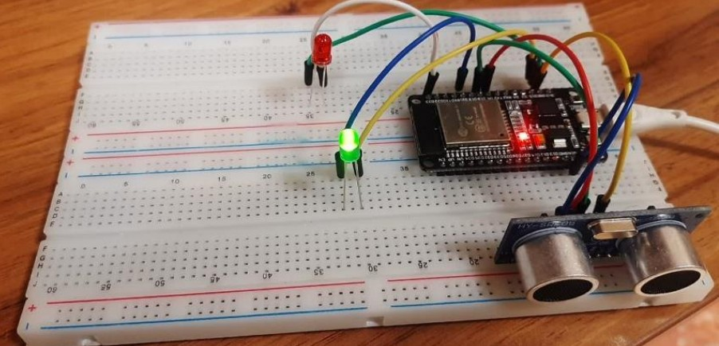

# Smart Parking System with ESP32 and Ultrasonic Sensor
This project is a smart parking system that uses an ESP32 microcontroller and an ultrasonic sensor (HC-SR04) to detect the availability of parking spaces and display the status.

## Features
- Measures distance using an ultrasonic sensor to detect vehicles.
- Indicates parking status with green (Empty) and red (Occupied) LEDs.
- Hosts a web server on the ESP32 to display real-time parking status with a dynamic SVG-based UI.
- Updates parking status after a 3-second detection threshold to avoid false positives.
- Wi-Fi connectivity for remote monitoring.

## Hardware Requirements
- **ESP32 Development Board** (e.g., NodeMCU, DevKit)
- **HC-SR04 Ultrasonic Sensor**
- **Red LED** (for Occupied status)
- **Green LED** (for Empty status)
- **Resistors** (e.g., 220Ω for LEDs)
- **Jumper wires** and **breadboard**

- ## Software Requirements
- **Arduino IDE** or **PlatformIO**
- **ESP32 Board Support Package** for Arduino IDE
- Required Arduino libraries:
  - `WiFi.h` (included with ESP32 core)
  - `WebServer.h` (included with ESP32 core)
- USB driver for ESP32 (if needed for your system)

## Wiring Diagram
| Component           | ESP32 Pin  |
|---------------------|------------|
| HC-SR04 Trig        | GPIO 5     |
| HC-SR04 Echo        | GPIO 18    |
| Red LED (Occupied)  | GPIO 23    |
| Green LED (Empty)   | GPIO 21    |

*Note*: Use appropriate resistors (e.g., 220Ω) for LEDs to prevent damage.

# Demo 
[**Watch the Project Presentation on Prezi**](https://prezi.com/view/lwAYcBoyaPiA9W808GFl/)  
---
## **Smart Parking System in Action:**

